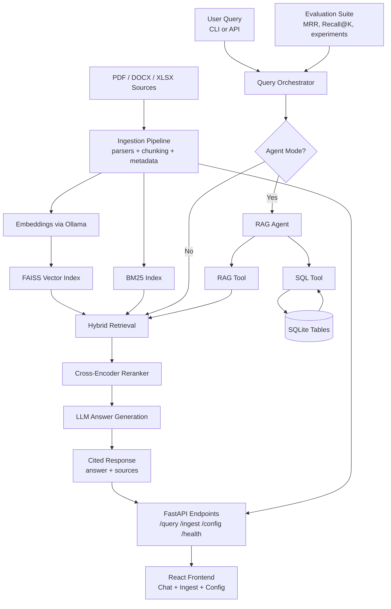

# RAG Science

Question-answering over scientific papers using local LLMs. Combines FAISS vector search, BM25 keyword retrieval, and cross-encoder reranking for high-quality results. Runs entirely locally via [Ollama](https://ollama.com) — no cloud APIs or keys required.

## Portfolio Snapshot

`RAG Science` is a local-first Retrieval-Augmented Generation (RAG) platform for scientific documents. It ingests PDF/DOCX/XLSX files, performs hybrid retrieval (dense + keyword), reranks results with a cross-encoder, and returns grounded answers with citations.

### Highlights

- Hybrid retrieval with `FAISS` + `BM25`
- Cross-encoder reranking for higher retrieval precision
- Citation-aware responses (`source` + `page`)
- FastAPI endpoints for querying, ingestion, sessions, and health checks
- Agent mode with tool selection between document RAG and safe text-to-SQL
- Local-only inference via Ollama
- Evaluation framework for MRR/Recall@K and experiment comparison
- React frontend with SSE streaming chat, config panel, and ingestion UI
- Test suite status: **223 passed**

### Architecture



## How It Works

```
PDF/DOCX/XLSX → markdown + chunk + embed → FAISS + BM25 indexes → hybrid retrieval → cross-encoder rerank → LLM/agent answer
```

1. **Ingest** — PDF/DOCX/XLSX files are normalized to markdown, split into overlapping chunks (max 500 tokens) with metadata (title, section, page). Chunks are embedded and stored in a FAISS vector index. A BM25 keyword index is built in parallel.
2. **Retrieve** — Queries run against both FAISS (semantic) and BM25 (keyword). Scores are fused, then a cross-encoder reranks the top candidates.
3. **Answer** — The best chunks are passed to an LLM with a citation-focused prompt. Sources are returned with each answer.

## Quick Start

### Prerequisites

- Python 3.11+
- [Ollama](https://ollama.com) running locally

```bash
ollama pull nomic-embed-text
ollama pull llama3.1:8b
```

### Setup

```bash
python -m venv .venv
source .venv/bin/activate
pip install -r requirements.txt
```

### Usage

Place documents in `./papers/` (PDF, DOCX, XLSX), then:

```bash
# Ingest papers
python ingest.py

# Ask a question
python query.py "What pixel size is used in the detector?"

# Interactive mode (supports follow-up questions)
python query.py
```

Example output:

```
Answer:
The pixel bump pitch is 50 µm × 50 µm for the ATLAS variant.

Sources: rd53cATLAS1v92.pdf p.7, introduction_guide.pdf p.20
```

## Frontend

A React + TypeScript chat UI with SSE streaming, document ingestion controls, and a runtime config panel.

```bash
cd frontend
npm install
npm run dev
```

Opens at `http://localhost:5173` and proxies API calls to the backend on port 8000.

## API Server

```bash
uvicorn api:app --host 0.0.0.0 --port 8000
```

### Endpoints

| Method | Path | Description |
|--------|------|-------------|
| `POST` | `/query` | Ask a question |
| `POST` | `/query/stream` | Ask a question (SSE streaming) |
| `POST` | `/ingest` | Trigger document ingestion |
| `GET` | `/config` | Get current runtime config |
| `PUT` | `/config` | Update runtime config |
| `POST` | `/config/save` | Save config to file |
| `POST` | `/config/load` | Load config from file |
| `DELETE` | `/sessions/{id}` | Clear a conversation session |
| `GET` | `/health` | Check Ollama connectivity |

### Examples

```bash
# Single question
curl -X POST http://localhost:8000/query \
  -H "Content-Type: application/json" \
  -d '{"question": "What architecture is used?"}'

# Multi-turn conversation
curl -X POST http://localhost:8000/query \
  -H "Content-Type: application/json" \
  -d '{"question": "What methods were used?", "session_id": "sess-1"}'

curl -X POST http://localhost:8000/query \
  -H "Content-Type: application/json" \
  -d '{"question": "Can you elaborate?", "session_id": "sess-1"}'
```

## Docker

```bash
docker-compose up --build
```

Runs the frontend on port 3000, the API on port 8000, and Ollama on port 11434 with GPU passthrough.

## Scheduled Ingestion

Apply the Kubernetes CronJob manifest to run ingestion every 3 hours:

```bash
kubectl apply -f k8s/ingest-cronjob.yaml
```

## Configuration

All settings are configurable via environment variables. Copy `.env.example` to `.env` to customize:

| Variable | Default | Description |
|----------|---------|-------------|
| `OLLAMA_BASE_URL` | `http://localhost:11434` | Ollama server URL |
| `LLM_MODEL` | `llama3.1:8b` | LLM model for answering |
| `EMBEDDING_MODEL` | `nomic-embed-text` | Embedding model |
| `CHUNK_SIZE` | `500` | Tokens per chunk |
| `TOP_K` | `4` | Final results returned |
| `TOP_K_CANDIDATES` | `50` | Candidates before reranking |
| `BM25_WEIGHT` | `0.3` | Keyword retrieval weight |
| `DENSE_WEIGHT` | `0.7` | Semantic retrieval weight |
| `ENABLE_S3_INGEST` | `false` | Enable S3 sync before local ingestion |
| `S3_LOOKBACK_HOURS` | `3` | S3 object age window for ingestion |
| `SESSION_TTL_SECONDS` | `3600` | API session expiry |
| `CORS_ORIGINS` | `*` | Allowed CORS origins |
| `ENABLE_PARENT_RETRIEVAL` | `false` | Use small chunks for retrieval, large for context |

## Testing

```bash
pip install -r requirements-dev.txt
pytest tests/ -v
```

## Evaluation

Curate your golden set in `eval/golden_dataset.json` and run:

```bash
python eval/evaluate.py
```

Reports source-level Mean Reciprocal Rank (MRR) and Recall@K.

You can also add optional chunk-level labels per query:

```json
{
  "question": "What model architecture was used in the study?",
  "expected_sources": ["paper1.pdf"],
  "expected_chunk_ids": ["paper1.pdf|p3|0a1b2c3d4e5f"]
}
```

When `expected_chunk_ids` are present, the evaluator also reports:
- chunk MRR
- chunk Precision@K
- chunk Recall@K

Chunk IDs are computed as:
`{source}|p{page}|{sha256(normalized_chunk_text)[:12]}`

To auto-generate `expected_chunk_ids` from existing `expected_sources`/`expected_pages`:

```bash
.venv/bin/python eval/generate_chunk_labels.py \
  --input eval/golden_dataset.json \
  --output eval/golden_dataset.json \
  --bm25 vectorstore/bm25_index.pkl
```

## Project Structure

```
├── config.py            # All settings with env var overrides
├── ingest.py            # PDF → chunks → FAISS + BM25 indexes
├── query.py             # Hybrid retrieval → reranking → LLM answer
├── api.py               # FastAPI REST server
├── health.py            # Ollama health check with retries
├── logging_config.py    # Centralized logging
├── frontend/            # React + Vite + TypeScript UI
├── papers/              # Input documents (PDF, DOCX, XLSX)
├── vectorstore/         # Generated indexes (FAISS + BM25)
├── tests/               # pytest suite
├── eval/                # Retrieval evaluation framework
├── Dockerfile
└── docker-compose.yml
```
